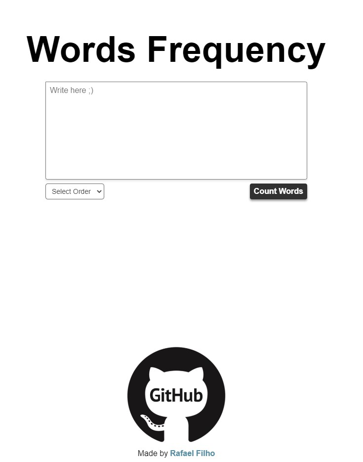
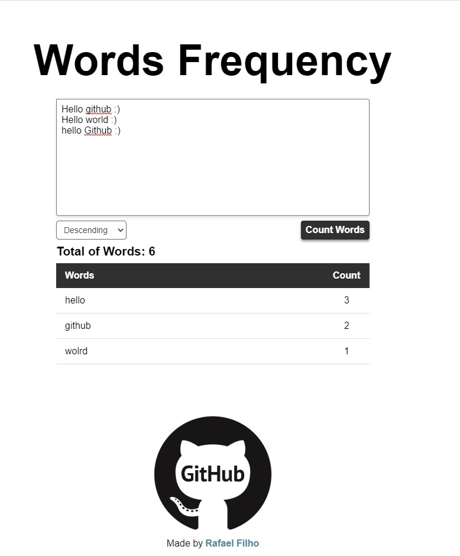

# Words Frequency
<h1 align="center">
  <p align="center" display="flex">
    
     
  </p>
</h1> 

## Table of contents
* [General info](#general-info)
* [Technologies](#technologies)
* [Setup](#setup)
* [Status](#status)
* [Final Considerations](#final-considerations)

## General Info
Simple website for counting repetition of words and the total it in a text.

## Technologies
Project is created with:

* Vue 2.6

## Setup
To run this project in local is necessery:

```
$ npm install
$ npm run serve
```
Or you can acess the link and check the website:

https://rafaelofil.github.io/Word-Frequency/


## Status

Project is: finished, but if I have any inspiration I will add. 

## Final considerations

Any feedback is welcome.

Made by <b>Rafael Filho</b>

<hr>
<p align="center"> I hope you enjoy 😎</p>
